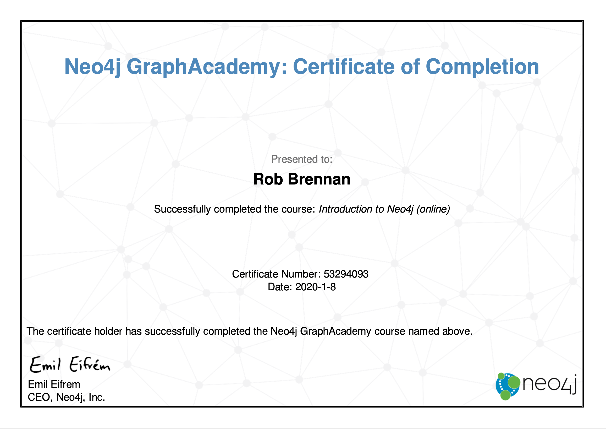

# Welcome

This project has been created to track my work and ideas while studying [Neo4j Graph Academy: Introduction to Neo4j](https://neo4j.com/graphacademy/online-training/introduction-to-neo4j)

## Course overview

This course consists of the following modules:

+ [About this course](https://neo4j.com/graphacademy/online-training/introduction-to-neo4j/part-0/#_about_this_course)
+ [Introduction to Graph Databases](https://neo4j.com/graphacademy/online-training/introduction-to-neo4j/part-1/)
+ [Introduction to Neo4j](https://neo4j.com/graphacademy/online-training/introduction-to-neo4j/part-2/)
+ [Setting Up Your Development Environment](https://neo4j.com/graphacademy/online-training/introduction-to-neo4j/part-3/)
+ [Introduction to Cypher](https://neo4j.com/graphacademy/online-training/introduction-to-neo4j/part-4/)
+ [Getting More Out of Queries](https://neo4j.com/graphacademy/online-training/introduction-to-neo4j/part-5/)
+ [Creating Nodes and Relationships](https://neo4j.com/graphacademy/online-training/introduction-to-neo4j/part-6/)
+ [Getting More Out of Neo4j](https://neo4j.com/graphacademy/online-training/introduction-to-neo4j/part-7/)
+ [Wrap up](https://neo4j.com/graphacademy/online-training/introduction-to-neo4j/part-8/)

## Helpful resources

Throughout this training, you should refer to:

+ [Neo4j Cypher Manual](https://neo4j.com/docs/cypher-manual/current/)
+ [Cypher Reference card](https://neo4j.com/docs/cypher-refcard/current/)
